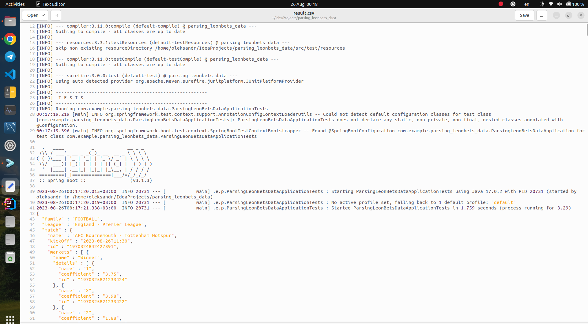

<h3> Instruction only for LINUX environment. </h3>

For run project just follow commands:

clone project:
```shell 
https://github.com/Snoke19/parsing_leonbets_data.git
```

go inside the project:
```shell 
cd ./parsing_leonbets_data 
```

just run the command in a terminal, and it will show the result that is described in the pdf file with the test task.

```shell
# show main result from test task

./mvnw exec:java
```


when result appear in the terminal they can be cutted and does not show fully. I recommend you to use redirection of the result to file - result.csv and then explore the result in the file.


```shell
# show main result from test task

./mvnw exec:java > result.csv
```
Example

